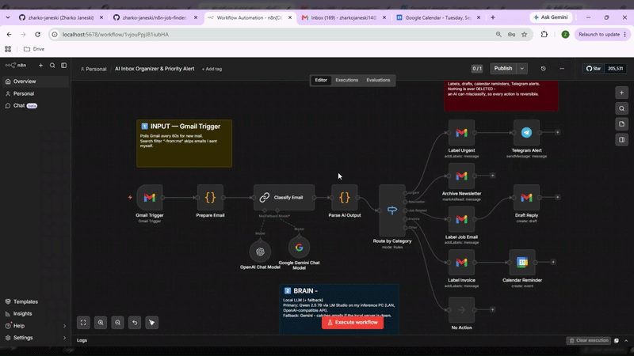
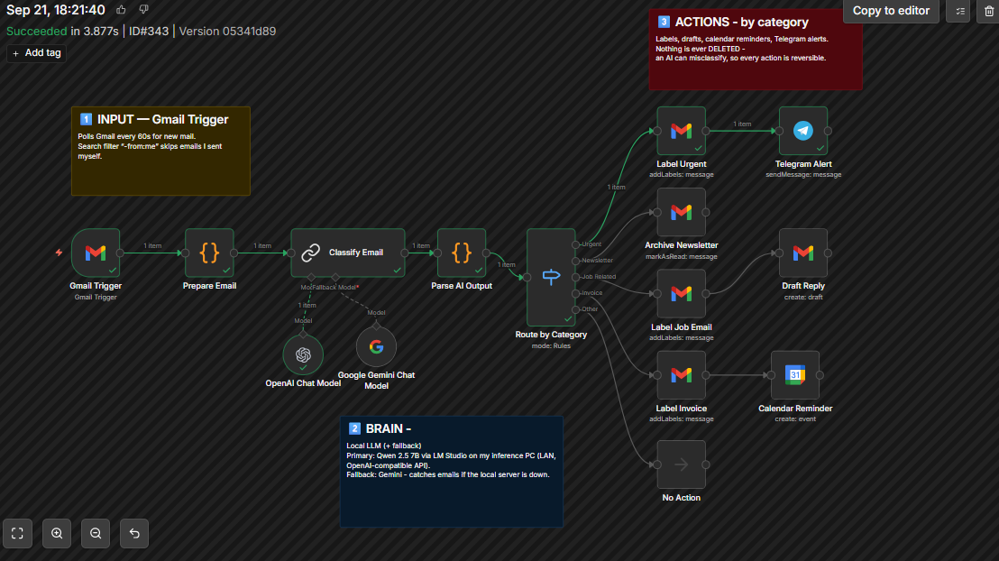
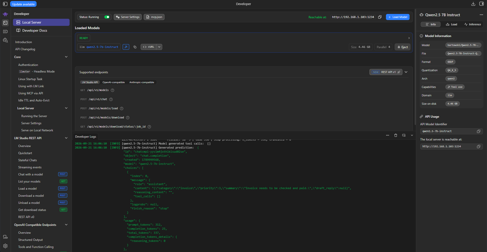
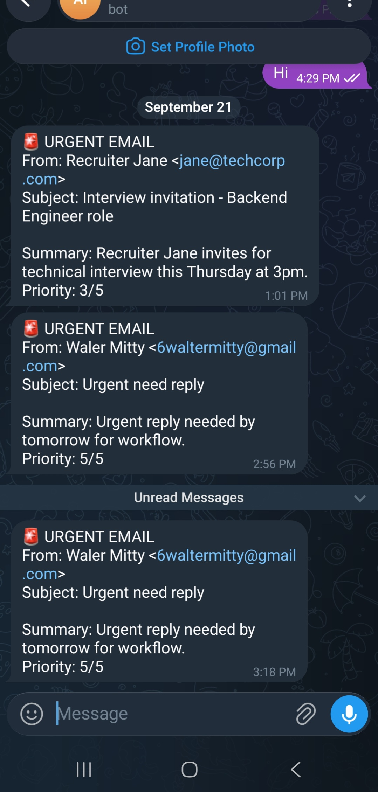

# 📬 AI Inbox Organizer & Priority Alert

An n8n automation that classifies incoming Gmail messages with an LLM and routes each email to an appropriate action.

The workflow classifies emails into five categories:

`urgent` · `newsletter` · `job-related` · `invoice` · `other`

Based on the classification, it can apply Gmail labels, archive newsletters, create reply drafts, schedule payment reminders in Google Calendar, or send urgent notifications to Telegram.

The primary classifier runs locally using **Qwen 2.5 7B** through **LM Studio**, with **Gemini** configured as a fallback model.

## Architecture

### Flow

**Gmail Trigger → Prepare Email → Classify Email → Parse AI Output → Route by Category**

## Email Routing

| Category | Action |
|---|---|
| **Urgent** | Adds `AI/Urgent` label and sends a Telegram alert containing the AI summary and priority (1–5). |
| **Job-related** | Adds `AI/Jobs` label and creates a reply draft. The reply is never sent automatically. |
| **Invoice** | Adds `AI/Invoices` label and creates a Google Calendar payment reminder. |
| **Newsletter** | Marks the email as read. |
| **Other** | No action is performed. |

## Local LLM

The primary classifier runs on a separate machine using **Qwen 2.5 7B** through **LM Studio**.

- **Model:** Qwen 2.5 7B Instruct
- **Format:** GGUF Q4_K_S
- **Size:** 4.4 GB
- **Interface:** OpenAI-compatible API
- **Network:** Local LAN
- **Endpoint:** `:1234`

The n8n server communicates with the inference machine over the local network.

Gemini is configured as the fallback model if the local inference server is unavailable.

## Output Validation

The LLM output is passed through a dedicated validation step before any action is performed.

The validation handles:

- Markdown code fences
- JSON extraction
- Allowed category validation
- Priority validation and clamping to `1–5`
- Invalid output fallback to `other`

## Action Safety

The workflow intentionally uses reversible actions.

**Labels → Mark as read → Create draft**

The workflow never deletes emails.

For job-related emails, the AI only creates a Gmail draft. The message is never sent automatically.

## Telegram Alert

If an email is classified as **urgent**, the workflow sends a Telegram alert with an AI-generated summary and priority.

  

## Setup

<strong>Setup Guide</strong>

1. Import `workflow.json` into n8n.
2. Enable the Gmail API and Google Calendar API.
3. Configure Google OAuth credentials in n8n.
4. Create the Gmail labels `AI/Urgent`, `AI/Jobs`, and `AI/Invoices`.
5. Configure LM Studio and serve Qwen 2.5 7B over the local network.
6. Configure Gemini as the fallback model.
7. Configure the Telegram bot and chat ID.

## Built With

**n8n · LM Studio · Telegram · Qwen 2.5 7B · Gmail API · Google Calendar · Gemini**

---

*Primary classifier: Qwen 2.5 7B running locally via LM Studio · Fallback: Gemini*
